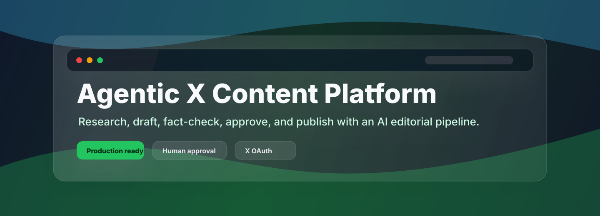
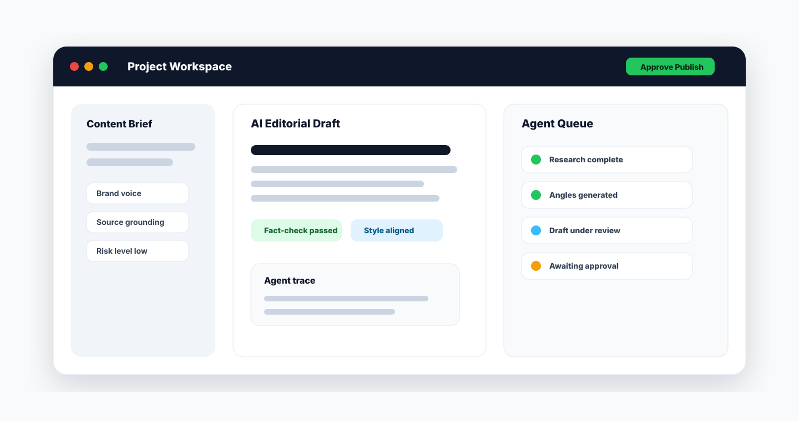
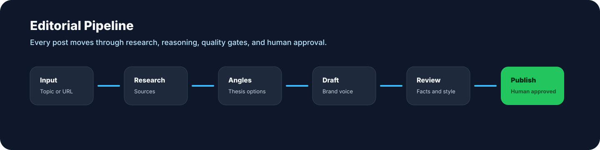
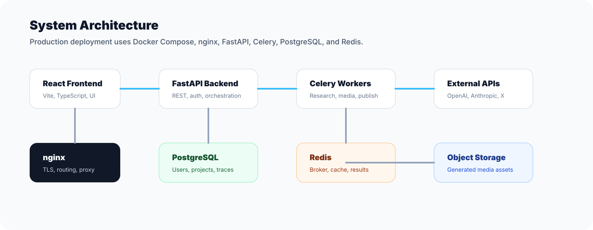

# Agentic X Content Platform

<p align="center">
  
</p>

<p align="center">
  <a href="#quick-start"></a>
  <a href="backend"></a>
  <a href="frontend"></a>
  <a href="docker-compose.prod.yml"></a>
</p>

<p align="center">
  AI-native editorial software for researching, drafting, fact-checking, and publishing high-signal content on X.
</p>

---

## Why This Exists

Most AI writing tools stop at "generate a post." This platform behaves more like an editorial team: it researches source material, finds a thesis, writes in a brand voice, runs quality checks, keeps agent traces, and only publishes after explicit approval.

It is built for production workflows where speed matters, but auditability and control matter more.

## Product Preview

<p align="center">
  
</p>

## Core Capabilities

| Area | What It Does |
| --- | --- |
| Agentic workflow | Research, insight extraction, angle generation, drafting, fact-checking, style review, editing, and publishing |
| Brand voice | Stores writing samples and reusable voice guidance for consistent output |
| Human approval | Drafts must pass review before publishing actions are available |
| X integration | OAuth 2.0 PKCE connection flow plus publish/status/disconnect APIs |
| Model routing | Strong and cost-efficient model tiers can be assigned by agent role |
| Observability | Agent traces capture inputs, outputs, model choices, latency, and token usage |
| Production deploy | Docker Compose, nginx, deployment scripts, backup/restore helpers, and health checks |

## Workflow

<p align="center">
  
</p>

1. Create a project from a topic, URL, X post, note, or file.
2. Run research and source grounding.
3. Generate insights and editorial angles.
4. Draft a post, thread, quote post, carousel, or media-backed concept.
5. Run fact-checking and style review.
6. Revise with human direction.
7. Approve, publish, schedule, or export.

## Architecture

<p align="center">
  
</p>

| Layer | Stack |
| --- | --- |
| Frontend | React 18, TypeScript, Vite, Tailwind CSS, TanStack Query |
| Backend | FastAPI, Pydantic v2, SQLAlchemy 2.x, Alembic |
| Workers | Celery with Redis broker/result backend |
| Database | PostgreSQL |
| AI providers | OpenAI, Anthropic, mock provider for local development |
| Publishing | X API v2 with OAuth 2.0 PKCE |
| Deployment | Docker Compose, nginx, shell automation |

## Quick Start

### Prerequisites

- Docker Desktop or Docker Engine with the Compose plugin
- Node.js 20+ for local frontend development
- Python 3.12+ for local backend development

### 1. Clone

```bash
git clone https://github.com/abylsliam44/x-ai.git
cd x-ai
```

### 2. Configure Environment

```bash
cp backend/.env.example backend/.env
```

For local work, keep `MOCK_MODE=true` to use fake providers without real API keys. For real publishing and model calls, fill in the OpenAI and X credentials in `backend/.env`.

### 3. Start Services

```bash
cd backend
docker compose up -d postgres redis
```

### 4. Start Backend

```bash
cd backend
python3.12 -m venv .venv
source .venv/bin/activate
pip install -r requirements.txt
alembic upgrade head
uvicorn app.main:app --reload --port 8000
```

### 5. Start Frontend

```bash
cd frontend
npm install
npm run dev
```

The app runs at `http://localhost:5173`. API docs are available at `http://localhost:8000/docs`.

## Environment Variables

Production and local examples live in:

- `backend/.env.example`
- `backend/.env.production.example`

Important backend settings:

| Variable | Purpose |
| --- | --- |
| `ENVIRONMENT` | Runtime environment: `development`, `staging`, or `production` |
| `DEBUG` | Enables debug behavior in non-production environments |
| `SECRET_KEY` | Application signing/encryption secret |
| `DATABASE_URL` | PostgreSQL connection string |
| `REDIS_URL` | Redis connection string |
| `MOCK_MODE` | Uses mock AI/search/media providers when `true` |
| `DEFAULT_LLM_PROVIDER` | `openai`, `anthropic`, or `mock` |
| `OPENAI_API_KEY` | Required when OpenAI is enabled |
| `ENABLE_REAL_X_API` | Enables live X OAuth and publishing |
| `X_CLIENT_ID` | X Developer Portal OAuth client id |
| `X_CLIENT_SECRET` | X Developer Portal OAuth client secret |
| `X_REDIRECT_URI` | OAuth callback URL |

Never commit real `.env` files. This repository ignores local environment files by default.

## Production Deployment

The production path is Docker Compose plus nginx.

```bash
./deploy/setup_server.sh
cp backend/.env.production.example backend/.env
./deploy/deploy.sh
```

See [deploy/README.md](deploy/README.md) for server setup, SSL, backups, restores, and health checks.

For X OAuth in production, configure this callback URL in the X Developer Portal:

```text
https://your-domain.com/api/v1/x/callback
```

Then set:

```env
X_REDIRECT_URI=https://your-domain.com/api/v1/x/callback
```

## API Surface

| Group | Endpoints |
| --- | --- |
| Auth | `POST /api/v1/auth/register`, `POST /api/v1/auth/login`, `GET /api/v1/auth/me` |
| X OAuth | `GET /api/v1/x/connect`, `GET /api/v1/x/callback`, `GET /api/v1/x/status`, `DELETE /api/v1/x/disconnect` |
| Projects | `POST /api/v1/projects`, `GET /api/v1/projects`, `GET /api/v1/projects/{id}` |
| Agents | Research, angle generation, draft generation, traces, and revisions |
| Drafts | Read, update, fact-check, revise, approve, and publish |

OpenAPI documentation is generated automatically at `/docs`.

## Repository Structure

```text
.
|-- backend/
|   |-- app/
|   |   |-- agents/          Agent implementations
|   |   |-- api/v1/          REST API routes
|   |   |-- core/            Settings, security, database, Redis
|   |   |-- models/          SQLAlchemy models
|   |   |-- providers/       LLM, search, media, and storage adapters
|   |   |-- schemas/         Pydantic schemas
|   |   |-- services/        Business logic
|   |   `-- workers/         Celery tasks
|   |-- alembic/             Database migrations
|   `-- tests/               Backend tests
|-- frontend/
|   |-- src/
|   |   |-- components/      Workflow and UI components
|   |   |-- hooks/           Query and state hooks
|   |   |-- lib/             API client and utilities
|   |   `-- pages/           Route-level pages
|   `-- Dockerfile
|-- deploy/                  Production automation
|-- docs/images/             README visuals
|-- nginx/                   Reverse proxy configuration
`-- docker-compose.prod.yml
```

## Security Notes

- Real secrets live only in local or server `.env` files.
- Generated bytecode, local storage, design archives, and AI assistant workspace files are ignored.
- X OAuth tokens are encrypted before storage.
- Publishing requires explicit user approval.
- Production traffic should terminate at HTTPS through nginx or your cloud load balancer.

## Development Checks

Recommended checks before opening a pull request:

```bash
cd backend
pytest
```

```bash
cd frontend
npm run build
```

## Deployment Utilities

| Script | Purpose |
| --- | --- |
| `deploy/setup_server.sh` | Prepare a fresh Ubuntu server |
| `deploy/deploy.sh` | Pull, build, migrate, and restart production services |
| `deploy/check_health.sh` | Verify service health after deployment |
| `deploy/backup_db.sh` | Create a PostgreSQL backup |
| `deploy/restore_db.sh` | Restore a PostgreSQL backup |

## Status

This repository is structured for a production deployment. Keep the default branch clean, commit only source/configuration/templates, and keep runtime secrets or generated artifacts out of Git.
